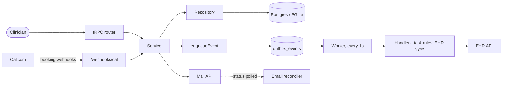

# Huxley Lite

A prototype of the task system for Outro's clinician tool, Huxley. Outro helps
patients safely taper off antidepressants; clinicians run that care from
Huxley. I built this to work out how tasks should hang off the care model
before we touch the real codebase. It is a slice, not the product, but it is
shaped like the product.

The database is embedded Postgres (PGlite), so there is nothing to install.
The EHR and email provider are hosted sandbox services; you'll get an API
key for them (see `.env.example` and `docs/integrations/`). Without a key
the app falls back to in-process fakes. Cal.com (booking) only talks to us
via webhooks, and a script stands in for it locally. The AI helper falls back to canned
text when there is no key.

## Run it

Requires Node 22+.

```sh
npm install
cp .env.example .env    # add the INTEGRATIONS_API_KEY you were given
npm run dev             # API on :3000, web on :3001
```

Open http://localhost:3001. The database is created and seeded on first start.

```sh
npm run test:run       # vitest: unit + integration, no Docker, no network
npm run typecheck
npm run lint
npm run db:reset       # wipe local data; next `npm run dev` re-seeds
npm run db:generate    # after editing src/server/db/schema.ts
npx tsx scripts/simulate-cal.ts storm chloe.carter@example.com   # fake Cal.com webhooks
```

## What a clinician can do

- **Patients**: see a patient, their medication, and where they are in care.
- **Care model**: every patient has an enrollment in exactly one stage
  (`intake → evaluation → decision_pending → eligible → active_care`, or
  `ineligible` / `archived`). Stage changes are append-only transitions.
  Staff can **correct** a stage when someone made a mistake.
- **Decide eligibility**: after the evaluation, mark a patient eligible or
  not. Eligible patients get an EHR chart and follow-up work.
- **Appointments**: see the schedule, mark an appointment completed
  (completing the evaluation moves the patient to `decision_pending`), or
  flag it (no-show, late cancel, ...). Bookings arrive from Cal.com by
  webhook.
- **Tasks**: an inbox of things that need a clinician. Tasks are created by
  rules reacting to events. The one type today is *send welcome email*:
  opens a template-filled draft the clinician edits and sends. Sending is
  asynchronous; the provider reports delivered or bounced later.
- **Events**: what the system did. Every event can be redelivered by hand.

There is no login. The sidebar lets you act as one of two seeded staff members
and the client sends that id in an `x-clinician-id` header.

## How it fits together



Events are written in the same request as the change that caused them. A
worker polls the outbox and delivers them to handlers; a delivery that fails
is retried with backoff and parked after five attempts. The Events page
shows every event and can redeliver one by hand.

Marking a patient eligible, step by step:

1. `patients.decideEligibility` (router) validates and calls the service.
2. `decideEligibility` (patients/service) records the note and asks the care
   model to move the enrollment to `eligible`.
3. `transitionStage` (careModel/service) checks the move is allowed, appends
   a transition, updates the enrollment, and enqueues
   `care_model.stage_changed`.
4. The worker picks the event up and runs its handlers:
   `createTasksForEvent` (runs the rules in `tasks/rules.ts`) and
   `syncEligiblePatientToEhr` (creates the chart).
5. The welcome-email rule returns a task spec; it's saved with the
   transition and enrollment it came from and appears in the inbox.
6. The clinician opens the task, gets a draft, edits it, and sends. The
   mail API accepts it; a poller asks the API what happened and marks the
   email delivered or bounced.

## Layout

```
src/server/
  index.ts                 HTTP server: tRPC + webhooks; starts the worker
  trpc.ts                  procedures, and unwrap() from Result to tRPC errors
  db/schema.ts             Drizzle schema, the source of truth for the domain
  db/seed.ts               demo data
  lib/result.ts            Result helpers (neverthrow)
  lib/ai.ts                LLM wrapper (Claude, or a fake). Unused so far.
  outbox/                  enqueue, worker, handler registry
  webhooks/                inbound: Cal.com bookings, email delivery reports
  integrations/            EHR and mail clients (HTTP, or local fakes), Cal webhook shapes
  features/emails/reconcile.ts   polls the mail API for delivery status
  features/<domain>/       repository.ts, service.ts, router.ts per domain
  features/careModel/stages.ts   the stage machine
  features/tasks/rules.ts        event ──▶ task specs
  features/tasks/taskTypes.ts    task type registry
  features/emails/templates.ts
  test/fixtures.ts         factories for integration tests

src/client/
  routes/                  tasks, patients, schedule, events
  components/ui/           primitives
  components/<domain>/     feature components and modals
  lib/api.ts               tRPC + react-query client
```

Conventions (layering, Result pattern, testing) are in [AGENTS.md](AGENTS.md).

## Where this is at

First cut. Known to be thin in places:

- One task rule, one task type, one template.
- The AI helper exists but nothing uses it.
- Corrections are recorded but nothing reacts to them yet.
- Tests cover the pipeline's delivery guarantees, the care model, webhooks,
  and the eligibility path. See `*.test.ts` and `*.integration.test.ts`.

Tech: TypeScript, React 19, Vite, TanStack Router + Query, tRPC 11, Drizzle,
PGlite, Tailwind, Radix, Vitest, Biome.
